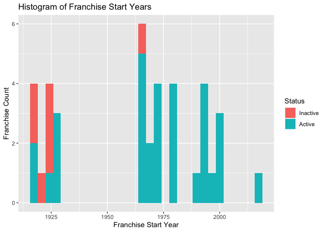

Project 1, ST558
================
Taylor Ashby
9/18/2020

  - [Accessing NHL Data](#accessing-nhl-data)
  - [A simpler way to access NHL
    data](#a-simpler-way-to-access-nhl-data)
  - [Exploring the Data](#exploring-the-data)
  - [Parting Thoughts](#parting-thoughts)

Below are the libraries needed for this project.

``` r
library(httr)
library(jsonlite)
library(dplyr)
library(ggplot2)
library(tidyr)
library(stringr)
```

# Accessing NHL Data

The [NHL Records
API](https://gitlab.com/dword4/nhlapi/-/blob/master/records-api.md) has
a variety of endpoints with different data you may be interested in. I
have created a set of functions that allow you to access each of the
endpoints. The first one, shown below, allows you to access the
/franchise endpoint using the `get_franchise_data` function.

``` r
#Here is the code showing how the get_franchise_data accesses and parses data
#from the /franchise endpoint.
get_franchise_data<-function(ID=NULL){
  myurl<-"https://records.nhl.com/site/api/franchise"
  a<-GET (myurl)
  a<-content(a,"text")
  a<-fromJSON(a, flatten=TRUE)
  a<-as.data.frame(a)
  a<-tibble(a)
  if(is.null(ID)==FALSE){a<-filter(a,data.id==ID)}
  a
}
```

To access the other endpoints, use one of these functions:

`get_franchise_totals`

`get_franchise_records`

`get_franchise_records`

`get_goalie_records`

`get_skater_records`

For `get_franchise_totals`, you have the option to provide a franchise
ID number that will filter the results to only the franchise of
interest. For the other four functions above, you are **required** to
provide this franchise ID, so that the function knows which franchise’s
data to return.

``` r
get_franchise_totals<-function(ID=NULL){
  myurl<-"https://records.nhl.com/site/api/franchise-team-totals"
  a<-GET (myurl)
  a<-content(a,"text")
  a<-fromJSON(a, flatten=TRUE)
  a<-as.data.frame(a)
  a<-tibble(a)
  if(is.null(ID)==FALSE){a<-filter(a,data.franchiseId==ID)}
  a
}

get_franchise_records<-function(ID=NULL){
  if(is.null(ID)){stop("Need a valid franchise ID number")}
  a<-GET (paste0("https://records.nhl.com/site/api/franchise-season-records?cayenneExp=franchiseId=",as.character(ID)))
  a<-content(a,"text")
  a<-fromJSON(a, flatten=TRUE)
  a<-as.data.frame(a)
  a<-tibble(a)
  a
}

get_goalie_records<-function(ID=NULL){
  if(is.null(ID)){stop("Need a valid franchise ID number")}
  a<-GET (paste0("https://records.nhl.com/site/api/franchise-goalie-records?cayenneExp=franchiseId=",as.character(ID)))
  a<-content(a,"text")
  a<-fromJSON(a, flatten=TRUE)
  a<-as.data.frame(a)
  a<-tibble(a)
  a
}

get_skater_records<-function(ID=NULL){
  if(is.null(ID)){stop("Need a valid franchise ID number")}
  a<-GET (paste0("https://records.nhl.com/site/api/franchise-skater-records?cayenneExp=franchiseId=",as.character(ID)))
  a<-content(a,"text")
  a<-fromJSON(a, flatten=TRUE)
  a<-as.data.frame(a)
  a<-tibble(a)
  a
}
```

There is also an [NHL Stats
API](https://gitlab.com/dword4/nhlapi/-/blob/master/stats-api.md) that
may be of interest. Use the `get_stats` function (details below) to
access it. Note that you can provide a team ID to filter the results
and/or provide a modifier input (using mod=) to access additional
detail. The 8 available modifiers are as follows:

`?expand=team.roster` Shows roster of active players for the specified
team

`?expand=person.names` Same as above, but gives less info.

`?expand=team.schedule.next` Returns details of the upcoming game for a
team

`?expand=team.schedule.previous` Same as above but for the last game
played

`?expand=team.stats` Returns the teams stats for the season

`?expand=team.roster&season=20142015` Adding the season identifier shows
the roster for that season

`?teamId=4,5,29` Can string team id together to get multiple teams

`?stats=statsSingleSeasonPlayoffs` Specify which stats to get.

``` r
get_stats<-function(ID=NULL, mod=NULL){
  if (is.null(ID)){partial_url<-"https://statsapi.web.nhl.com/api/v1/teams"}
    else {partial_url<-paste0("https://statsapi.web.nhl.com/api/v1/teams/",ID)}
  a<-if(is.null(mod)){partial_url}
        else {paste0(partial_url,mod)}
  a<-GET (a)
  a<-content(a,"text")
  a<-fromJSON(a, flatten=TRUE)
  a<-as.data.frame(a)
  a<-tibble(a)
  a
}
```

# A simpler way to access NHL data

To make things a little easier, I’ve created a new function called
`get_hockey_data` that is a one-stop shop, for all of the above
endpoints. Details are below, but the basic idea is that you simply call
this function and pass it the endpoint you want, along with an ID number
and/or modifier (if applicable).

``` r
get_hockey_data<-function(endpoint=NULL,ID=NULL,mod=NULL){
  if(is.null(endpoint)){stop("Need valid endpoint")}
    else if (endpoint=="franchise_data"){get_franchise_data(ID)}
    else if (endpoint=="franchise_totals"){get_franchise_totals(ID)}
    else if (endpoint=="franchise_records"){get_franchise_records(ID)}
    else if (endpoint=="goalie_records"){get_goalie_records(ID)}
    else if (endpoint=="skater_records"){get_skater_records(ID)} 
    else if (endpoint=="team_stats"){get_stats(ID)} 
}
```

# Exploring the Data

Now that we can access the data, the fun begins\! We can explore the
data using tools like contingency tables, histograms, scatter plots, and
more.

As a starting point, let’s look at the history of the NHL. More
specifically, we’ll look at when the teams were founded and which ones
are still active. A histogram would be helpful here.

``` r
#First we need to access data from the "franchise_data" endpoint
hist<-get_hockey_data(endpoint="franchise_data")

#The NHL season typically spans two years, but that makes the data a bit tricky to work with. 
#So we'll extract the very first year value for ease-of-use.
hist<-separate(hist,data.firstSeasonId,into=c("startYear","firstSpring"),sep=4)

#We will need to create a variable for active status, identified by missing values in the lastSeasonID
#variable.
hist<-mutate(hist,active=is.na(data.lastSeasonId))

#Now we are ready to create a histogram using the ggplot package.
g<-ggplot(hist,aes(x=as.numeric(startYear),fill=active))
g+geom_histogram()+scale_fill_discrete(name="Status",labels=c("Inactive","Active"))+
  ylab("Franchise Count")+xlab("Franchise Start Year")+
  labs(title="Histogram of Franchise Start Years")
```

<!-- -->

``` r
#Pull most recent team. Note that 2002 was somewhat arbitrary, just selected 
#based on a visual inspection of the histogram.
filter(hist,startYear>2002)%>%select(data.teamPlaceName,data.teamCommonName)
```

    ## # A tibble: 1 x 2
    ##   data.teamPlaceName data.teamCommonName
    ##   <chr>              <chr>              
    ## 1 Vegas              Golden Knights

From the histogram above, we can see that NHL expansions happen in
bursts, with many teams created just before and during 1920s. Things
were stagnant until the 1960s when a large number of teams were created.
The next burst happened in the 1990s and early 2000s and one outlier
that occurred in just the last few years. Out of curiosity, I have
filtered based on startYear to identify who that most recent franchise
is…the Golden Knights of Las Vegas.

As we saw in the histogram above, the history of the NHL dates to well
before WWII. Next we’ll create a contingency table that tells us which
conference has more pre-WWII teams. Note that we are now using team
data, rather than franchise.

``` r
#Access team data from the "team_stats" endpoint.
preWar<-get_hockey_data(endpoint="team_stats")

#Create a variable that indicates whether team existed before World War II.
preWar<-mutate(preWar,preWWII=(as.numeric(teams.firstYearOfPlay)<1939))

#Do a find/replace to make the labels of our contingency table a little more intuitive.
preWar$preWWII<-str_replace_all(preWar$preWWII, 'TRUE', 'Before WWII')
preWar$preWWII<-str_replace_all(preWar$preWWII, 'FALSE', 'After WWII')

#Create a contingency table to show which conference (Eastern or Western) has
#more pre-WWII teams
table(preWar$preWWII,preWar$teams.conference.name)
```

    ##              
    ##               Eastern Western
    ##   After WWII       11      14
    ##   Before WWII       5       1

It is clear that the Eastern Conference has more pre-WWII teams than the
Western conference. Perhaps this is driven by population distributions
over the early twentieth century. With long distance travel not as easy
as it is today, early hockey teams were more concentrated in the
population centers of the east coast.

We would expect that those older teams have played more games than the
newer teams. Let’s create a scatter plot to investigate this hypothesis.

``` r
#Get total games by franchise
c<-get_hockey_data(endpoint="franchise_totals")
c<-c%>%group_by(data.franchiseId)%>%summarise(totalGames=sum(data.gamesPlayed))
c
```

    ## # A tibble: 38 x 2
    ##    data.franchiseId totalGames
    ##               <int>      <int>
    ##  1                1       7490
    ##  2                2          6
    ##  3                3        631
    ##  4                4        150
    ##  5                5       7286
    ##  6                6       7234
    ##  7                7        672
    ##  8                8        802
    ##  9                9        260
    ## 10               10       7022
    ## # … with 28 more rows

``` r
#Get franchise data
d<-get_hockey_data(endpoint="franchise_data")
d<-rename(d,data.franchiseId=data.id)

#Join by franchiseId so that totalGames column is included
e<-inner_join(c,d)

#Calculate franchise age and create scatter plot of franchise age vs.total games played
es<-separate(e,data.firstSeasonId,into=c("startYear","firstSpring"),sep=4)
es<-mutate(es,FranchiseAge=2020-as.numeric(startYear))

g<-ggplot(es,aes(x=FranchiseAge,y=totalGames))

g+geom_point()+ylab("Total Games Played")+xlab("Franchise Age")+ 
  geom_smooth(method=lm,col="Green") + 
  labs(title="Total Games Played by Franchise Age")
```

<!-- -->

Generally, we see that the relationship holds, i.e., older teams have
played more games. However, as we saw previously in our histogram, there
are several inactive franchises that were founded around the 1920s.
These show up in the bottom right corner of our scatter plot, and weaken
the linear relationship. If we exclude inactive teams, that should
strengthen the linear relationship between age and total games played.

``` r
#Filter out inactive teams (i.e., those where last season ID is populated).
es<-filter(es,is.na(data.lastSeasonId)==TRUE)

#Create another scatter plot
g<-ggplot(es,aes(x=FranchiseAge,y=totalGames))

g+geom_point()+ylab("Total Games Played")+xlab("Franchise Age")+ 
  geom_smooth(method=lm,col="Green") + 
  labs(title="Total Games Played by Franchise Age (excl. Inactive)")
```

<!-- -->

If we only look at active franchises, the correlation between age and
games played is near-perfect.

It is pretty intuitive to think that active teams would have played more
games than inactive teams. There are a variety of other ways to
explore/display that relationship. For example, we can create
quantitative summaries of games played by active status:

``` r
#Create new variable indicating if the franchise is active
e<-mutate(e,active=is.na(data.lastSeasonId))

#Create quantitative summary by active status
qs<-e %>% group_by(active)%>%summarise(averageGames=mean(totalGames), medianGames=median(totalGames),grandTotal=sum(totalGames))
qs
```

    ## # A tibble: 2 x 4
    ##   active averageGames medianGames grandTotal
    ##   <lgl>         <dbl>       <int>      <int>
    ## 1 FALSE          484.         631       3390
    ## 2 TRUE          3915.        3867     121369

Or we could create box plots of games played by active status:

``` r
#Create box plots comparing the Games played for Active and Inactive Teams
g<-ggplot(e,aes(x=active))
g+geom_boxplot(aes(y=totalGames,fill=active))+theme(legend.position="none")+
  xlab("Is Franchise Still Active?")+
  ylab("Total Games Played")+labs(title="Total Games by Active Status")+
  scale_x_discrete(labels=c("No","Yes"))
```

<!-- -->

Both of these approaches make clear that active teams have played far
more games on average than inactive teams.

Now we’ll move on to looking at player stats, rather than franchise
stats. For this exercise, we’ll look specifically at goalies from the
Carolina Hurricanes franchise (formerly the Hartford Whalers). We might
wonder about the experience level our current set of goalies. In other
words, do we have any “long timers” that are active goalies for the
Hurricanes. We can call a goalie a long timer, if they’ve played more
games than the average goalie (based on the average of all goalies in
the history of the franchise).

``` r
#Get goalie data for Carolina Hurricanes franchise
b<-get_hockey_data(endpoint="goalie_records",ID=26)

#Create a column that indicates whether a goalie is a longTimer, meaning they 
#have played more games than the average goalie (within the Canes franchise)
b<-mutate(b,longTimer=(data.gamesPlayed>mean(b$data.gamesPlayed)))
b
```

    ## # A tibble: 38 x 31
    ##    data.id data.activePlay… data.firstName data.franchiseId data.franchiseN…
    ##      <int> <lgl>            <chr>                     <int> <chr>           
    ##  1     277 FALSE            Cam                          26 Carolina Hurric…
    ##  2     310 FALSE            Arturs                       26 Carolina Hurric…
    ##  3     336 FALSE            Tom                          26 Carolina Hurric…
    ##  4     363 FALSE            Richard                      26 Carolina Hurric…
    ##  5     369 FALSE            Sean                         26 Carolina Hurric…
    ##  6     411 FALSE            Mark                         26 Carolina Hurric…
    ##  7     425 FALSE            John                         26 Carolina Hurric…
    ##  8     430 FALSE            Mario                        26 Carolina Hurric…
    ##  9     470 FALSE            Pat                          26 Carolina Hurric…
    ## 10     490 FALSE            Mike                         26 Carolina Hurric…
    ## # … with 28 more rows, and 26 more variables: data.gameTypeId <int>,
    ## #   data.gamesPlayed <int>, data.lastName <chr>, data.losses <int>,
    ## #   data.mostGoalsAgainstDates <chr>, data.mostGoalsAgainstOneGame <int>,
    ## #   data.mostSavesDates <chr>, data.mostSavesOneGame <int>,
    ## #   data.mostShotsAgainstDates <chr>, data.mostShotsAgainstOneGame <int>,
    ## #   data.mostShutoutsOneSeason <int>, data.mostShutoutsSeasonIds <chr>,
    ## #   data.mostWinsOneSeason <int>, data.mostWinsSeasonIds <chr>,
    ## #   data.overtimeLosses <int>, data.playerId <int>, data.positionCode <chr>,
    ## #   data.rookieGamesPlayed <int>, data.rookieShutouts <int>,
    ## #   data.rookieWins <int>, data.seasons <int>, data.shutouts <int>,
    ## #   data.ties <int>, data.wins <int>, total <int>, longTimer <lgl>

``` r
#Rename variable values to make the table more intuitive
b$longTimer<-str_replace_all(b$longTimer, 'TRUE', 'Long Timer')
b$longTimer<-str_replace_all(b$longTimer, 'FALSE', 'Newbie')
b$data.activePlayer<-str_replace_all(b$data.activePlayer, 'TRUE', 'Active')
b$data.activePlayer<-str_replace_all(b$data.activePlayer, 'FALSE', 'Inactive')

#Create a table telling us if any of the active goalies are longTimers
table(b$data.activePlayer,b$longTimer)
```

    ##           
    ##            Long Timer Newbie
    ##   Active            0      6
    ##   Inactive          9     23

Unfortunately, we have no long timers that are active.

Before they were the Carolina Hurricanes, the franchise played as the
Hartford Whalers. We might wonder which of these two teams fared better.
We will create a new measure of success called goal ratio, which is a
ratio of average *goals for* to average *goals against* per game. Then
we will compare the Hurricanes to the Whalers, with a break out for
regular season and playoff games.

``` r
#Get data from the franchise totals end point, filtered to franchise #26.
f<-get_hockey_data(endpoint="franchise_totals",ID=26)

#Create new variables called avgGoals and avgGoalsAgainst. 
f<- f %>% mutate(avgGoals=data.goalsFor/data.gamesPlayed,
                  avgGoalsAgainst=data.goalsAgainst/data.gamesPlayed)

#Create a new variable called goalRAtio and filter data to only the relevant variables.
h<-mutate(f, goalRatio=avgGoals/avgGoalsAgainst)
h %>% select(data.teamName,goalRatio,data.gameTypeId)
```

    ## # A tibble: 4 x 3
    ##   data.teamName       goalRatio data.gameTypeId
    ##   <chr>                   <dbl>           <int>
    ## 1 Carolina Hurricanes     0.956               3
    ## 2 Carolina Hurricanes     0.946               2
    ## 3 Hartford Whalers        0.880               2
    ## 4 Hartford Whalers        0.808               3

``` r
#Create a bar graph, comparing the teams' goal ratios.
g<-ggplot(h,aes(data.teamName,goalRatio,fill=as.factor(data.gameTypeId)))
g+geom_bar(stat="identity",position="dodge")+scale_fill_discrete(name="Game Type",labels=c("Regular Season","Playoff"))+
  xlab("Team Name")+ylab("Ratio of Goals Scored to Goals Against")
```

<!-- -->

By this new Goal Ratio metric, the Hurricanes are the clear winner.
Another interesting observation is that the Hurricanes tended to perform
slightly better, again by this one metric, in the playoffs compared with
the regular season. Conversely, the Whalers tended to perform better in
the regular season than in the playoffs.

# Parting Thoughts

The NHL APIs are a treasure trove of information for hockey fans and
data nerds alike. I hope this vignette provides a good introduction for
how to access the data and explore what it means. Thanks for reading\!
